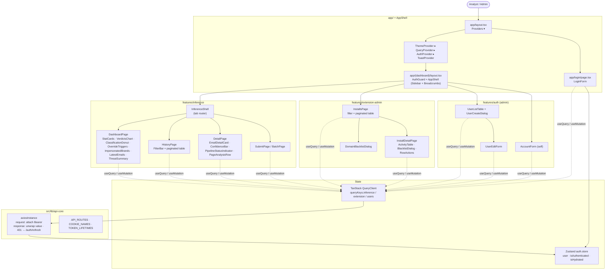

# SENTRY Dashboard

Next.js 16 / React 19 admin panel for **SENTRY** — the phishing email detection and analysis system. This is the analyst-facing surface: it visualises classifier output, drives manual review of flagged emails, and gives admins a console for managing the Chrome extension installs that submit emails for live analysis.

The dashboard lives as a separate component because:
- **It is the analyst's tool, not the API's tool.** The API speaks a JSON envelope; turning that into charts, paginated tables, filter bars, and a sidebar is presentation work that does not belong in a FastAPI process.
- **Different deploy and refresh cadence.** The UI is iterated on far more often than the inference pipeline; keeping it independent avoids dragging the API through cosmetic releases.
- **Distinct auth surface from the Chrome extension.** Both consume the same API but with different tokens and rate limits — the dashboard uses cookie-stored JWTs with silent refresh; the extension uses opaque install tokens. Pulling them apart removes one large class of accidental cross-contamination.

---

## What this app does

- **Live operations dashboard** (`/inference?tab=dashboard`) — stat cards, a verdicts-over-time chart, a classification donut, override-trigger and impersonated-brand breakdowns, a "latest emails" list. All data is read from `/api/v1/inference/stats/*` and `/api/v1/inference/emails`.
- **History** (`/inference?tab=history`) — paginated, filterable email table (classification, confidence band, date range, pipeline status, override trigger, sender match).
- **Email detail** (`/inference?tab=detail&id=...`) — verdict, confidence bar, pipeline status, aggregation note, per-link page-analysis breakdown.
- **Submit / batch submit** (`/inference?tab=submit` and `?tab=batch`) — push one or many emails into the inference pipeline directly from the dashboard.
- **Manual review** — analyst attaches a note; admin can override the classification or re-queue the email (`reanalyze`).
- **Install management** (`/extension/installs`, ADMIN only) — list installs with filters (email, domain, version, status, last-seen window), drill into per-install activity, blacklist a single install or every install on a domain, revoke tokens.
- **User management** (`/users`, ADMIN only) — create / edit / activate / deactivate dashboard users.
- **Account** (`/account`) — self-service profile edit.

---

## Architecture & design decisions

### App Router with route groups

`app/(dashboard)/layout.tsx` wraps every authenticated route with `<AuthGuard>` + `<AppShell>`. The route group `(dashboard)` exists so `/login` and `/unauthorized` can render at the top-level without the sidebar. `app/page.tsx` is just `redirect('/inference')` — the inference console is the home tab.

### Feature-folder layout

Domain logic is grouped by feature under `src/features/`:

```
src/features/{auth,inference,extension-admin,system}/
  api/         # axios calls + types (one .api.ts per resource, plus .types.ts)
  components/  # feature-scoped React components
  hooks/       # TanStack Query wrappers (use-auth, use-inference, use-stats, ...)
  guards/      # AuthGuard (auth feature only)
  stores/      # Zustand store (auth feature only)
  index.ts     # public surface; importers consume only from here
```

Cross-cutting code lives in `src/lib/api-core/` (axios instance, query client, constants, types) and `src/components/` (`shadcn/`, `layout/`, `providers/`).

### Auth: cookie-stored JWTs with silent refresh

`src/lib/api-core/api-clients.ts` is the single axios instance. The request interceptor reads the access token from a `js-cookie` cookie and attaches `Authorization: Bearer ...`. The response interceptor:

1. Unwraps the API's `ApiResponse` envelope and rejects on `success: false`.
2. On a structured `401`, queues the failed request, hits `POST /auth/refresh` with the refresh-token cookie, and replays the queue with the new access token. A second concurrent 401 piggy-backs on the in-flight refresh rather than firing a second one.
3. If the refresh itself fails (or no refresh cookie exists), it clears cookies and redirects to `/login` — but only if the current path is not `/login`, to avoid a reload loop when `/auth/me` 401s on the login page itself.

Cookie expiry mirrors the JWT's server-side lifetime (`TOKEN_LIFETIMES.ACCESS_TOKEN_MINUTES = 30`, `REFRESH_TOKEN_DAYS = 7`) — the API does not return `expires_at`, so these constants must stay in sync with `ACCESS_TOKEN_EXPIRE_MINUTES` / `REFRESH_TOKEN_EXPIRE_DAYS` on the API side.

### State split: Zustand (auth) + TanStack Query (everything else)

- **Zustand** (`src/features/auth/stores/auth.store.ts`) holds only auth state: `user`, `isAuthenticated`, `isHydrated`. The store has no persistence layer — it is rehydrated on every page load by `<AuthProvider>` calling `useProfile()` (`GET /auth/me`). Until hydration completes, the global `<PageLoader>` blocks the UI so guards never flash partial layouts.
- **TanStack Query** owns server state: emails, stats, installs, users. Mutations invalidate the relevant query keys (e.g. `['inference', 'emails']` and `['inference', 'stats']` after a submit) so charts and tables refresh together.

`<AuthGuard>` re-reads `isHydrated` defensively even though the global `<AuthProvider>` already gates on it — it is rendered by `(dashboard)/layout.tsx` and so cannot rely on the provider's gate when used outside.

### Tabbed views via search params, not nested routes

`/inference` and `/extension/installs` use `?tab=...` instead of nested routes (`InferenceShell` in `src/features/inference/components/inference-shell.tsx:33`). Tab switches are `router.push` with `scroll: false` so the shell does not remount and TanStack Query caches survive across tabs. Detail pages use a second query param (`?tab=detail&id=<uuid>`) so deep links and the back button both work without separate routes.

### UI primitives: shadcn + Tailwind 4 + Radix

`src/components/shadcn/` is the unmodified shadcn set; everything else composes on top of it. `lucide-react` for icons, `recharts` for charts, `sonner` for toasts (`<ToastProvider />` mounted in `providers.tsx`), `next-themes` for light/dark.

### CamelCase wire format, no client-side renaming

The API serialises with `by_alias=True`, so every payload arrives in camelCase (`createdAt`, `pipelineStatus`, `firstName`). Types in `src/features/*/api/*.types.ts` and `src/lib/api-core/types.ts` mirror the wire shape verbatim — there is no transform layer. The one exception is the refresh request: the API expects snake_case `refresh_token`, and the axios refresh call sends it that way explicitly.

### Dev vs. prod base URL

`getApiBaseUrl()` returns `http://127.0.0.1:8000/api/v1` in development and `process.env.NEXT_PUBLIC_API_BASE_URL` in production. This is the only env var the dashboard needs.

---

## Component / data-flow diagram



---

## How it connects to the API

The companion repo is **[sentry-api](https://github.com/kudzaiprichard/sentry-api)** (folder: `Api`).

| Direction | What flows | Initiator |
|---|---|---|
| dashboard → API | `POST /auth/login` (cookie tokens), then JWT-bearered reads/writes against `/inference/*`, `/users/*`, `/extension/installs/*`. The refresh path posts `{refresh_token}` (snake_case) to `/auth/refresh` | Dashboard, on user interaction or token expiry |
| API → dashboard | `ApiResponse` / `PaginatedResponse` envelopes (camelCase). On `success: false` with `status: 401` the axios interceptor triggers silent refresh; any other code rejects to the caller as an `ApiError` | API, in response |

There is no websocket or polling channel — verdicts arrive when the analyst opens an email's detail, or when a tab refresh re-fires the relevant query. The pipeline runs in the background on the API side, so a recently-submitted email may be `pipelineStatus: "running"` for a few seconds; the detail page polls (via TanStack Query refetch) to see it transition to `complete`.

---

## Setup

### Prerequisites

- Node.js 20+
- npm (lockfile is `package-lock.json`)
- The API running locally on `http://127.0.0.1:8000` for development

### First run

```bash
npm install
npm run dev
```

The dev server starts on `http://localhost:3000`. The first visit redirects to `/login`; sign in with the API's seeded admin (`ADMIN_EMAIL` / `ADMIN_PASSWORD`).

### Other scripts

```bash
npm run build    # next build
npm run start    # next start (production server, requires npm run build first)
npm run lint     # eslint
```

There is no test suite configured.

---

## Environment variables

| Var | Default | Notes |
|---|---|---|
| `NEXT_PUBLIC_API_BASE_URL` | — | Production API base, e.g. `https://api.sentry.example.com/api/v1`. Only consulted when `NODE_ENV !== 'development'`; dev hardcodes `http://127.0.0.1:8000/api/v1` |
| `NODE_ENV` | `development` (next dev) | Switches the dev/prod base URL and toggles the `secure` cookie flag |

There is no `.env.example` in this repo — `NEXT_PUBLIC_API_BASE_URL` is the only var required, and only for non-dev builds.

### Variables that must be kept in sync with the API

These are not env vars in the dashboard, but constants in `src/lib/api-core/constants.ts` that mirror server-side values. If the API's lifetimes change, update these too — the dashboard never reads `expires_at` from the response.

| Dashboard constant | API env var | Default |
|---|---|---|
| `TOKEN_LIFETIMES.ACCESS_TOKEN_MINUTES` | `ACCESS_TOKEN_EXPIRE_MINUTES` | 30 |
| `TOKEN_LIFETIMES.REFRESH_TOKEN_DAYS` | `REFRESH_TOKEN_EXPIRE_DAYS` | 7 |
| `USER_ROLES.ADMIN` / `IT_ANALYST` | enum `Role` in `src/modules/auth/domain/models/enums.py` | — |

The dashboard origin must also be in the API's `CORS_ORIGINS` (default includes `http://localhost:3000`). The API's `CORS_ALLOW_CREDENTIALS=true` is required because the dashboard ships cookies on every request.

---

## Related repositories

| Repo | Role | Description |
|---|---|---|
| **[sentry_frontend](https://github.com/kudzaiprichard/sentry_frontend)** | Admin dashboard (this repo) | Next.js 16 + React 19 panel. Renders the inference console, history, install management, and user admin. |
| **[sentry-api](https://github.com/kudzaiprichard/sentry-api)** | Backend API | FastAPI + PostgreSQL service. Owns auth, the inference pipeline (Groq + Gemini + Playwright), and extension install governance. |
